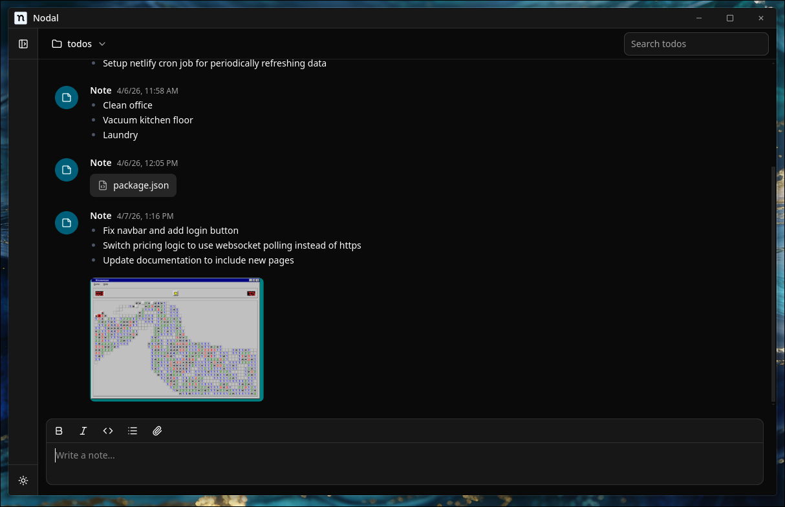

# Nodal

[](https://opensource.org/licenses/MIT)
[](https://nodejs.org/)
[](https://electronjs.org/)
[](https://vitejs.dev/)
[](https://react.dev/)
[](https://www.typescriptlang.org/)

**Nodal** is an open-source, desktop note-taking app with a Discord-inspired interface. Folders act like servers — select one from the sidebar and your notes appear as a scrollable message feed. Write in plain text or Markdown, and keep everything organized on your local filesystem.



## ✨ Features

- **📁 Folder-as-server layout** — your note folders are listed in a sidebar just like Discord servers, click one to open its note feed
- **📝 Discord-style note feed** — notes inside a folder are displayed as a chronological message list
- **✍️ Markdown support** — write notes in Markdown with a built-in CodeMirror editor and rendered preview
- **📎 Attachment support** — attach files to your notes
- **🗂️ Custom notes directory** — choose any directory on your machine as the root for your notes
- **🎨 Theming** — light and dark mode support via a theme store
- **⚡ Fast & local** — built on Electron; all notes are stored as plain files on disk, no account or internet connection required
- **🔄 Auto Updater** — built-in update mechanism using `electron-updater`

## 📋 Prerequisites

- Node.js 18+
- [Bun](https://bun.sh/)
- Git

## 🛠️ Quick Start

### 1. Clone the Repository

```bash
git clone https://github.com/your-username/nodal.git
cd nodal
```

### 2. Install Dependencies

```bash
bun install
```

### 3. Start Development

```bash
bun run dev
```

This starts both the Vite dev server and Electron in development mode with hot reload.

## 📁 Project Structure

```
├── electron/                        # Electron main process
│   ├── main.ts                      # Main process entry point
│   ├── preload.ts                   # Preload script for IPC
│   ├── update.ts                    # Auto-updater logic
│   └── electron-env.d.ts            # TypeScript definitions
├── src/                             # React renderer source
│   ├── App.tsx                      # Root layout (Sidebar + Navbar + Notes feed)
│   ├── main.tsx                     # React entry point
│   ├── index.css                    # Global stylesheet & CSS variables
│   ├── components/
│   │   ├── sidebar.tsx              # Folder list (the "server" sidebar)
│   │   ├── navbar.tsx               # Top bar for the active folder
│   │   ├── create-folder-dialog.tsx # Dialog for creating a new folder
│   │   ├── folder-select-dialog.tsx # Dialog for choosing the notes directory
│   │   ├── notes/
│   │   │   ├── notes-container.tsx  # Scrollable note feed
│   │   │   ├── note-item.tsx        # Individual note / message bubble
│   │   │   ├── notes-input.tsx      # Compose bar for new notes
│   │   │   └── markdown-editor.tsx  # CodeMirror-based Markdown editor
│   │   ├── providers/               # React context providers
│   │   └── ui/                      # Reusable shadcn/ui components
│   └── lib/
│       ├── types.ts                 # Shared TypeScript types (Note, etc.)
│       ├── utils.ts                 # Utility helpers
│       └── hooks/store/
│           ├── use-app-store.ts     # Zustand store (folders, notes, directory)
│           └── use-theme-store.ts   # Zustand store (light/dark theme)
├── public/                          # Static assets
├── docs/                            # Documentation assets (screenshots, etc.)
├── electron-builder.json            # Electron Builder configuration
├── vite.config.ts                   # Vite configuration
├── components.json                  # shadcn/ui configuration
└── package.json                     # Dependencies and scripts
```

## 🔧 How It Works

| Discord concept | Nodal equivalent |
|-----------------|-----------------|
| Server          | Folder           |
| Channel         | *(the folder itself)* |
| Message         | Note             |

1. On first launch, choose a **notes directory** — the root folder where Nodal will read and write your notes.
2. Create **folders** from the sidebar. Each folder appears like a server icon.
3. Select a folder to open its **note feed**.
4. Type a note in the compose bar at the bottom and press Enter (or click Send). Notes support full **Markdown** syntax.
5. Notes are persisted as files inside the chosen directory, so they remain accessible with any text editor outside of Nodal.

## 🚀 Available Scripts

| Script | Description |
|--------|-------------|
| `bun run dev` | Start Electron + Vite in development mode with hot reload |
| `bun run build` | Compile TypeScript, bundle with Vite, and package with Electron Builder |
| `bun run build:ci` | TypeScript + Vite build only (no packaging) |
| `bun run lint` | Run ESLint across the project |
| `bun run preview` | Preview the Vite production build |

## 📦 Building for Production

```bash
bun run build
```

Packaged output is placed in the `release/` directory:

- **Windows** — `.exe` NSIS installer
- **macOS** — `.dmg` disk image
- **Linux** — `.AppImage` and `.deb` packages

## 🔄 Auto Updater

Nodal includes an automatic update system powered by `electron-updater`:

- Checks for updates on launch
- Shows download progress and notifications
- Configured via `electron-builder.json` → `publish`

To enable auto-updates for your own fork:
1. Create a GitHub repository for releases.
2. Update `electron-builder.json` with your `owner` and `repo`.
3. Add a `RELEASE_PUSH_TOKEN` secret to your repository (a GitHub token with `repo` scope).
4. Push a tag matching `v*` — GitHub Actions will build and publish the release automatically.

## 🎨 Tech Stack

| Layer | Technology |
|-------|------------|
| Desktop shell | [Electron](https://electronjs.org/) |
| Build tool | [Vite](https://vitejs.dev/) |
| UI framework | [React 18](https://react.dev/) |
| Language | [TypeScript](https://www.typescriptlang.org/) |
| Styling | [Tailwind CSS v4](https://tailwindcss.com/) |
| Component library | [shadcn/ui](https://ui.shadcn.com/) |
| State management | [Zustand](https://zustand-demo.pmnd.rs/) |
| Code editor | [CodeMirror 6](https://codemirror.net/) via `@uiw/react-codemirror` |
| Markdown rendering | [react-markdown](https://github.com/remarkjs/react-markdown) + remark-gfm |
| Persistence | [electron-store](https://github.com/sindresorhus/electron-store) |
| Icons | [Remix Icon](https://remixicon.com/) + [Lucide](https://lucide.dev/) |

## 🤝 Contributing

Contributions are welcome!

1. Fork the repository
2. Create a feature branch (`git checkout -b feat/my-feature`)
3. Commit your changes
4. Open a pull request

Please make sure `bun run lint` passes before submitting.

## 📄 License

This project is licensed under the **MIT License** — see the [LICENSE](LICENSE) file for details.